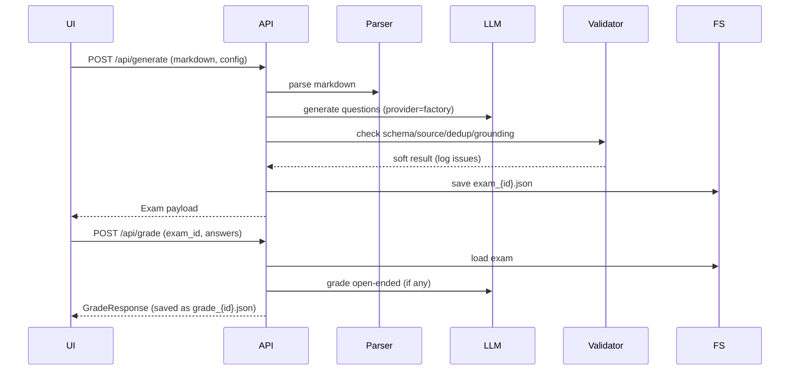

# Architecture

## High-Level Components
- **API**: FastAPI (`app/main.py`) serving REST + static UI.
- **Core** (`app/core`):
  - `parser.py` — Markdown → structured sections.
  - `generator.py` — provider-agnostic LLM generation, soft validation (grounding/dedup), deterministic with `seed`.
  - `grader.py` — choice grading locally, open-ended via LLM rubric.
  - `validator.py` — schema/source refs/dedup/grounding heuristics.
  - `retriever.py` — placeholder for future RAG.
- **Providers** (`app/services/llm_provider.py`): factory for OpenAI/Yandex/local stub; shared prompts.
- **Storage**: filesystem `data/` (`uploads/`, `out/`, `results/`); exams listing supports sort/pagination.
- **UI** (`static/`): upload → generate → view/exams → take/grade; provider/model selectors; import exam panel.
- **Deployment**: Docker/Compose with configurable `PORT`/`HOST`; stdout logging.

## Sequence (Generation & Grading)


## Data Model (concise)
- **Exam** `{exam_id, questions[], config_used}`.
- **Question** `{id, type, stem, options?, correct?, reference_answer?, rubric?, source_refs[], meta{difficulty,tags[]}}`.
- **ExamConfig** supports counts or ratios (missing `open_ended_ratio` auto-filled), `language`, `provider`, `model_name`, `seed`.
- **GradeResponse** `{summary{total, correct, score_percent}, per_question[] with partial_credit, feedback}`.

## Logging & Validation
- Basic stdout logging (container-friendly).
- Generator logs provider/model, counts, attempts, grounding/coverage metrics; validation soft-fails but logs issues.

## Extensibility Notes
- Swap storage for DB/object store via thin repository layer around `data/`.
- Enable RAG by replacing `retriever.py` and passing retrieved chunks into generation.
- Auth/rate-limits can wrap FastAPI middleware; CORS currently wide open for demo.

## Solution Snapshot

### Capabilities
- **Generation**: counts/ratios, difficulty, language (en/ru), provider/model selection; local stub for offline; deterministic with seed.
- **Validation**: schema + source refs + dedup + grounding heuristics (soft by default, logged).
- **Grading**: choice scored locally with partial credit; open-ended via LLM rubric; results persisted.
- **Exams API**: upload/list files, generate, grade, import exams; listing with sorting/pagination.
- **UI**: provider/model selectors, count controls, exam table with pagination, in-app exam import, gov-style palette.
- **Ops**: Docker + Compose (`PORT`/`HOST`), data volume, stdout logs.

### Metrics & Evaluation (current/practical)
- Generation: grounding overlap ratio, section coverage, answerability (implicit), coherence heuristics.
- Grading: partial credit distribution, open-ended rubric scores.
- Model eval scripts (CLI): accuracy/AI pass rate per model, cost estimates (token-based heuristic), grading consistency.

### Operational Notes
- Default provider can be set to `local` for demo; set OpenAI/Yandex keys in `.env` to use real models.
- Exams and grades stored under `data/out/`; uploads under `data/uploads/`; results under `data/results/`.
- Errors: validation issues are soft (logged); unexpected failures return generic 500.

## Frontend Architecture

**Last Updated**: 2026-01-13 (Issue #9)
**Status**: Production-ready modular architecture

## Overview

The frontend has been completely refactored from a monolithic 879-line HTML file into a clean, modular architecture with professional error handling and user experience.

## Architecture

### File Structure

```
static/
├── index.html          # 170 lines (was 879) - Clean HTML structure
├── css/
│   └── style.css       # 225 lines - All styles extracted
└── js/                 # 953 lines total - Modular JavaScript
    ├── api-client.js   # 167 lines - API communication layer
    ├── ui-utils.js     # 191 lines - UI helpers & validation
    ├── file-manager.js # 89 lines  - File upload & management
    ├── exam-manager.js # 258 lines - Exam generation & management
    ├── test-taker.js   # 192 lines - Test taking & grading
    └── main.js         # 56 lines  - Application initialization
```

### Improvement Metrics

| Metric | Before (inline) | After (modular) | Change |
|--------|----------------|-----------------|--------|
| HTML size | 879 lines | 170 lines | -81% |
| CSS organization | Inline `<style>` | External file | ✅ |
| JS organization | Inline `<script>` | 6 modules | ✅ |
| Error handling | `alert()` | Professional UI | ✅ |
| Code duplication | High | Zero | ✅ |
| Maintainability | Low | High | ✅ |
| Testability | Impossible | Possible | ✅ |

## Module Descriptions

### 1. api-client.js - API Communication Layer

**Purpose**: Centralized API communication with consistent error handling

**Key Features**:
- Custom `APIError` class with HTTP status codes
- All endpoints wrapped in clean API object
- Automatic JSON encoding
- Proper URL encoding
- Network error detection

**Example Usage**:
```javascript
try {
    const exam = await API.generateExam(config);
    console.log('Exam created:', exam.exam_id);
} catch (error) {
    if (error instanceof APIError) {
        console.error(`API Error ${error.status}:`, error.message);
    }
}
```

**Endpoints**:
- `API.uploadFile(file)` - Upload markdown file
- `API.getFiles()` - List uploaded files
- `API.getFileContent(filename)` - Get file content
- `API.generateExam(config)` - Generate exam
- `API.getExams(params)` - List exams with pagination
- `API.getExam(examId)` - Get specific exam
- `API.gradeExam(examId, answers)` - Grade answers
- `API.importExam(examData)` - Import external exam

### 2. ui-utils.js - UI Helpers & Validation

**Purpose**: Reusable UI feedback and validation utilities

**Key Features**:
- Loading states with spinners
- Success/error message display
- Smart error message mapping (HTTP codes → user-friendly text)
- Input validation (files, configs)
- Formatting utilities (file sizes, dates)
- Debounce function

**Example Usage**:
```javascript
// Show loading
UIUtils.showLoading('resultDiv', 'Processing...');

// Show success
UIUtils.showSuccess('resultDiv', 'Upload complete!');

// Show API error with smart message
try {
    await API.uploadFile(file);
} catch (error) {
    UIUtils.showAPIError('resultDiv', error);
    // Automatically shows user-friendly message based on status code
}

// Validate file
const validation = UIUtils.validateFile(file);
if (!validation.valid) {
    UIUtils.showError('resultDiv', validation.error);
}
```

**Error Message Mapping**:
- **0** (Network): "Cannot connect to server. Please check your internet connection."
- **400**: "Invalid input: {details}"
- **404**: "Resource not found."
- **413**: "File too large. Maximum size is 10MB."
- **429**: "Too many requests. Please wait a moment and try again."
- **500+**: "Server error. Please try again later."

### 3. file-manager.js - File Operations

**Purpose**: Handle file upload and management

**Key Features**:
- File validation (type, size)
- Upload with progress feedback
- File list display
- Dropdown population for file selection

**Functions**:
- `handleFileUpload(event)` - Process file upload
- `loadFileList()` - Display uploaded files
- `populateFileSelect()` - Fill dropdown options

### 4. exam-manager.js - Exam Management

**Purpose**: Exam generation, listing, and viewing

**Key Features**:
- Exam generation with validation
- Pagination support
- Sorting and filtering
- Exam preview

**Functions**:
- `updateQuestionTotal()` - Update question counter
- `generateExam()` - Create new exam
- `loadExamList()` - Display exam list with pagination
- `viewExam(examId)` - Show exam details
- `changeExamSort()` - Change sort/filter
- `nextExamPage()` / `prevExamPage()` - Pagination
- `populateExamSelect()` - Fill exam dropdown

**State Management**:
```javascript
let examSort = 'created';    // Sort field
let examOrder = 'desc';       // Sort order
let examPage = 1;             // Current page
let examPageSize = 10;        // Items per page
let examMeta = {};            // Pagination metadata
```

### 5. test-taker.js - Test Taking & Grading

**Purpose**: Handle test taking workflow and grading

**Key Features**:
- Dynamic test rendering
- Support for single/multiple/open-ended questions
- Visual feedback for selected options
- AI-powered grading display
- Detailed results with feedback

**Functions**:
- `loadExamForTest()` - Load exam into test UI
- `updateOptionStyles()` - Visual selection feedback
- `submitTest(event)` - Submit and grade answers

**State**:
```javascript
let currentExam = null;  // Currently loaded exam
```

### 6. main.js - Application Initialization

**Purpose**: Application entry point and global setup

**Key Features**:
- DOM ready detection
- Tab switching logic
- Event listener setup
- Initial data loading

**Functions**:
- `switchTab(tabName)` - Navigate between tabs
- `initializeApp()` - Initialize on page load

## Design Patterns

### Module Pattern
Each JavaScript file is a self-contained module with:
- Clear purpose and responsibility
- Public API exported to `window` object
- Private functions when needed
- JSDoc documentation

### Error Handling Pattern
```javascript
async function someOperation() {
    const resultDiv = 'someResult';
    UIUtils.showLoading(resultDiv, 'Processing...');

    try {
        const result = await API.someEndpoint();
        UIUtils.showSuccess(resultDiv, 'Success!');
        // Update UI
    } catch (error) {
        UIUtils.showAPIError(resultDiv, error);
    }
}
```

### Validation Pattern
```javascript
// Validate before API call
const validation = UIUtils.validateFile(file);
if (!validation.valid) {
    UIUtils.showError('resultDiv', validation.error);
    return;
}

// Proceed with API call
try {
    await API.uploadFile(file);
} catch (error) {
    UIUtils.showAPIError('resultDiv', error);
}
```

## User Experience Improvements

### Before (Inline Code)
```javascript
// ❌ Poor error handling
if (!filename) {
    alert('Please select a file first');
    return;
}

// ❌ Silent errors
catch (error) {
    console.error('Error loading files:', error);
}

// ❌ Generic errors
catch (error) {
    alert('Error: ' + error.message);
}
```

### After (Modular Code)
```javascript
// ✅ Professional validation
if (!filename) {
    UIUtils.showError('resultDiv', 'Please select a file first');
    return;
}

// ✅ User-visible errors with context
catch (error) {
    console.error('Error loading files:', error);
    // Still logged but not shown to user for background operations
}

// ✅ Smart, user-friendly errors
catch (error) {
    UIUtils.showAPIError('resultDiv', error);
    // Shows: "File too large. Maximum size is 10MB." instead of
    // "Error: HTTP Error 413"
}
```

## CSS Organization

### Variables (Design System)
```css
:root {
    --blue: #0b63c5;
    --blue-dark: #0a4da0;
    --red: #e64040;
    --sand: #f7f8fb;
    --ink: #1f2a3d;
    --muted: #6b7280;
}
```

### Component Styles
- Global reset and base styles
- Layout containers
- Tab system
- Cards and grids
- Forms and buttons
- Question display
- Loading states
- Feedback messages

## Development Workflow

### Adding a New Feature

1. **Identify the module** - Which module should handle this?
2. **Add function** - Write new function in appropriate module
3. **Export** - Add to module's window export
4. **Use** - Call from HTML or other modules
5. **Test** - Manual testing in browser
6. **Document** - Add JSDoc comments

### Example: Adding File Delete

```javascript
// 1. Add to file-manager.js
async function deleteFile(filename) {
    const resultDiv = 'fileResult';

    if (!confirm(`Delete ${filename}?`)) return;

    UIUtils.showLoading(resultDiv, 'Deleting...');

    try {
        await API.deleteFile(filename);  // Assumes endpoint exists
        UIUtils.showSuccess(resultDiv, 'File deleted!');
        await loadFileList();
    } catch (error) {
        UIUtils.showAPIError(resultDiv, error);
    }
}

// 2. Export
window.FileManager = {
    // ... existing exports
    deleteFile
};

// 3. Use in HTML
<button onclick="window.FileManager.deleteFile('file.md')">Delete</button>
```

## Testing

### Manual Testing Checklist

- [ ] File upload (valid .md file)
- [ ] File upload (invalid file type)
- [ ] File upload (>10MB file)
- [ ] File list loads
- [ ] Exam generation (various configs)
- [ ] Exam generation (validation errors)
- [ ] Exam list with pagination
- [ ] Exam view/preview
- [ ] Test taking (all question types)
- [ ] Answer grading
- [ ] Error messages display correctly
- [ ] Loading states show
- [ ] Network errors handled gracefully

### Browser DevTools

**Console Logs**:
- Application initialization
- API requests/responses
- Errors with full details

**Network Tab**:
- Monitor API calls
- Check request/response payloads
- Verify error responses

## Future Improvements

### Potential Enhancements

1. **Testing**:
   - Add Jest for JavaScript unit tests
   - Add Cypress for E2E tests
   - Test coverage for modules

2. **Build Process**:
   - Add webpack/vite bundler
   - Minification for production
   - Tree shaking
   - Code splitting

3. **TypeScript**:
   - Add type safety
   - Better IDE support
   - Catch errors early

4. **Framework**:
   - Consider React/Vue/Svelte for complex features
   - Component-based architecture
   - Better state management

5. **Progressive Enhancement**:
   - Offline support with Service Workers
   - Local storage for drafts
   - Progressive Web App features

6. **Accessibility**:
   - ARIA labels
   - Keyboard navigation
   - Screen reader support
   - Focus management

7. **Performance**:
   - Lazy loading for large exams
   - Virtual scrolling for long lists
   - Request debouncing
   - Response caching

## Related Documentation

- [README.md](../README.md) - Project overview
- [CLAUDE.md](../CLAUDE.md) - Development guidelines
- [SECURITY.md](SECURITY.md) - Security policy
- [AUDIT_REPORT.md](AUDIT_REPORT.md) - Full project audit

## Changelog

### 2026-01-13 - Initial Modular Architecture
- Extracted CSS to external file (225 lines)
- Created 6 JavaScript modules (953 lines)
- Reduced HTML from 879 to 170 lines (-81%)
- Implemented professional error handling
- Added input validation
- Improved user experience significantly

**Commits**:
- d93355e: Extract CSS to separate file
- 3d76bbf: Create API client and UI utilities
- 8524db5: Complete modularization

**Issue**: #9 - UI improvements and frontend refactoring
