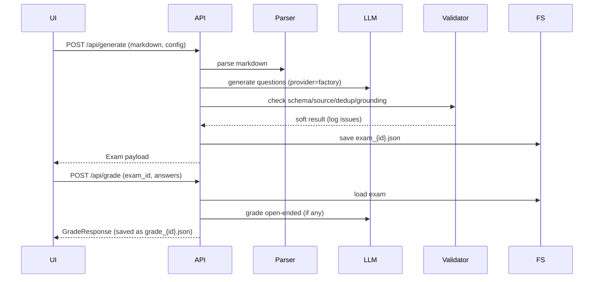

# Architecture

## High-Level Components
- **API**: FastAPI (`app/main.py`) serving REST + static UI.
- **Core** (`app/core`):
  - `parser.py` — Markdown → structured sections.
  - `generator.py` — provider-agnostic LLM generation, soft validation (grounding/dedup), deterministic with `seed`.
  - `grader.py` — choice grading locally, open-ended via LLM rubric.
  - `validator.py` — schema/source refs/dedup/grounding heuristics.
  - `retriever.py` — placeholder for future RAG.
- **Providers** (`app/services/llm_provider.py`): factory for OpenAI/Yandex/local stub; shared prompts.
- **Storage**: filesystem `data/` (`uploads/`, `out/`, `results/`); exams listing supports sort/pagination.
- **UI** (`static/`): upload → generate → view/exams → take/grade; provider/model selectors; import exam panel.
- **Deployment**: Docker/Compose with configurable `PORT`/`HOST`; stdout logging.

## Sequence (Generation & Grading)

## Data Model (concise)
- **Exam** `{exam_id, questions[], config_used}`.
- **Question** `{id, type, stem, options?, correct?, reference_answer?, rubric?, source_refs[], meta{difficulty,tags[]}}`.
- **ExamConfig** supports counts or ratios (missing `open_ended_ratio` auto-filled), `language`, `provider`, `model_name`, `seed`.
- **GradeResponse** `{summary{total, correct, score_percent}, per_question[] with partial_credit, feedback}`.

## Logging & Validation
- Basic stdout logging (container-friendly).
- Generator logs provider/model, counts, attempts, grounding/coverage metrics; validation soft-fails but logs issues.

## Extensibility Notes
- Swap storage for DB/object store via thin repository layer around `data/`.
- Enable RAG by replacing `retriever.py` and passing retrieved chunks into generation.
- Auth/rate-limits can wrap FastAPI middleware; CORS currently wide open for demo.
